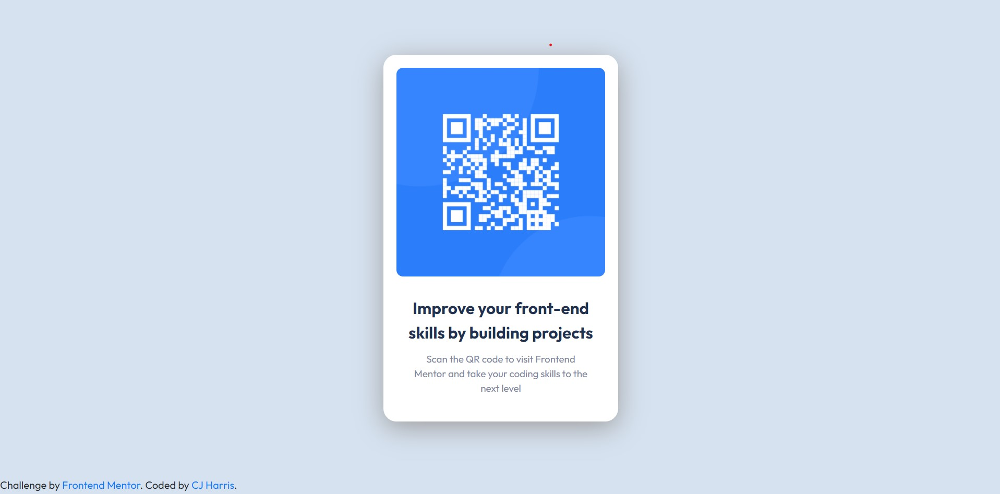

# Frontend Mentor - QR code component solution

This is a solution to the [QR code component challenge on Frontend Mentor](https://www.frontendmentor.io/challenges/qr-code-component-iux_sIO_H). Frontend Mentor challenges help you improve your coding skills by building realistic projects.

## Table of contents

- [Overview](#overview)
  - [Screenshot](#screenshot)
  - [Links](#links)
- [My process](#my-process)
  - [Built with](#built-with)
  - [What I learned](#what-i-learned)
  - [Continued development](#continued-development)
- [Author](#author)

## Overview

### Screenshot

### Links

- Solution URL: [https://www.frontendmentor.io/solutions/responsive-qr-code-component-using-html-and-css-RAGkn5lzg](https://www.frontendmentor.io/solutions/responsive-qr-code-component-using-html-and-css-RAGkn5lzg)
- Live Site URL: [https://caylemh.github.io/frontend-dev-qr-component/](https://caylemh.github.io/frontend-dev-qr-component/)

## My process

I first began with the HTML skeleton for the project and then proceeded to implement the CSS styles for the final look and outcome.

### Built with

- Semantic HTML5 markup
- CSS
- CSS custom properties
- Desktop-first workflow

### What I learned

Using HTML and CSS together with Bootstrap to create a simple yet stylish component.

- Update: Removed Bootstrap and used Flex Box layout which worked better in this case.

### Continued development

To eventually make the QR Component interactive and to produce a Modal Component for a working website.

## Author

- Frontend Mentor - [@caylemh](https://www.frontendmentor.io/profile/caylemh)
